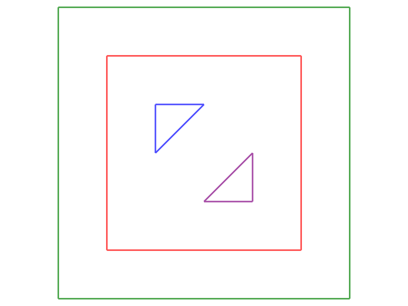

# Le projet d'algo 2020

Bienvenue dans le projet d'algo 2020.

Cette année, on s'intéresse à l'inclusion de polygones.

Le sujet n'est pas compliqué :

- on prend en entrée un ensemble de polygones simples
- on affiche sur la sortie standard quel polygone est inclus dans quel autre polygone

## Entrée

On récupère en entrée un ensemble de polygones à partir d'un fichier *.poly*.
Ce format de fichier texte est basé sur le principe suivant :

- chaque ligne est constituée de 3 éléments séparés par un ou plusieurs espaces : un entier, un flottant, un flottant
- les deux flottants forment les coordonnées *x* et *y* d'un point
- l'entier en début de ligne indique à quel polygone ce point est rajouté, en partant de 0
- l'ordre des lignes du fichier indique l'ordre des points des polygones
- les indices des polygones sont consécutifs (tous les points du polygone 0, puis tous les points du polygone 1, ...)

Au chargement, chaque fichier est converti en un vecteur de polygones.

À noter qu'il n'y a **jamais** d'intersection de segments entre deux polygones différents.
Au sein d'un même polygone seuls les segments consécutifs s'intersectent et uniquement à leurs
extrémités.

## Détection d'inclusion

Pour ce projet, on ne vous donne pas d'algorithme complet. Néanmoins, un des algorithmes de base qu'il vous faudra
implémenter consiste à détecter si un point est à l'intérieur d'un polygone. On peut y arriver en *partant* du point dans
une direction arbitraire et en comptant le nombre de segments du polygone traversés sur notre chemin. Si c'est impair le
point est à l'intérieur sinon à l'extérieur. Pour essayer d'éviter les problèmes liés aux erreurs d'arrondi et simplifier les calculs,
le mieux est d'avancer
verticalement ou horizontalement.

Pour plus d'info voir [wikipedia](https://en.wikipedia.org/wiki/Point_in_polygon)

## Sortie

En sortie on vous demande d'afficher sur la sortie standard le vecteur indiquant quel polygone est inclus (directement) dans quel autre polygone.
On identifie chaque polygone par son numéro. Comme tout polygone ne peut être inclus (directement) que dans au plus un autre
polygone, il suffit pour stocker la solution d'associer à chaque polygone l'indice de son père ou *-1* s'il n'en a aucun.
Le plus simple est alors de stocker cette information dans un vecteur tel que la ième case contient le père du ième polygone.

Par exemple le fichier *10x10.poly* fourni contient les deux polygones ci-dessous :

Le polygone 0 est affiché en rouge et le polygone 1 en vert. Comme le vert est inclus dans le rouge et que le rouge n'est inclus
dans personne la solution est le vecteur [-1, 0].

Afficher la solution consiste simplement à faire un *print* de ce vecteur ce qui est d'ailleurs déjà réalisé ligne 30
du fichier *main.py* fourni.

Second exemple, le fichier *e2.poly* suivant (0 est rouge, 1 est vert, 2 est bleu, 3 est violet):

a pour solution : [1, -1, 0, 0]

## Code fourni

On vous fourni un petit module de géométrie : *geo*.

Celui-ci contient toutes les classes de base (points, segments, polygones) ainsi qu'un module d'affichage à base de *tycat*.
Tous les objets de base sont affichables ainsi que les itérables et itérateurs sur des objets de base.
Vous pouvez voir comment ça fonctionne en examinant les fichiers *hello.py* et *tycat.py*.

Le fichier *main.py* est important car il sera utilisé pour les tests automatiques. Vous pouvez (devez) le modifier mais attention !
Il faut respecter la sémantique : la sortie standard doit contenir exactement une ligne par fichier donné en argument, dans l'ordre donné.
Chaque ligne est un *print* d'un vecteur d'entiers.

## Tournoi

### Principe

Vous disposez pour gérer votre code d'un repository gitlab.

Il se trouve que j'ai un accès direct sur ce dernier et que je suis en mesure
de récupérer automatiquement votre code.

Chaque nuit, le script de gestion du tournoi va télécharger la dernière version de votre code.
Si un changement est détecté il lance alors toute une série de tests automatiques
(en exécutant le fichier *main.py* fourni sur des exemples secrets).
On vérifie que les résultats sont corrects et on prend une mesure du temps pris par votre programme.
Éventuellement, le programme est tué s'il traîne un peu trop.
Si vous passez la deadline, on relance alors votre code sur des tests plus difficiles.
Il existe actuellement trois niveaux de difficulté.

Les résultats seront ensuite consultable en ligne sur :

- les high scores pour les différents niveaux de difficulté
    * [0](http://datamove.imag.fr/frederic.wagner/algo/high_score_0.html)
    * [1](http://datamove.imag.fr/frederic.wagner/algo/high_score_1.html)
    * [2](http://datamove.imag.fr/frederic.wagner/algo/high_score_2.html)

- un récapitulatif de tous les runs de chaque équipe sur *http://datamove.imag.fr/frederic.wagner/algo/nom_repository.html*

Le tournoi est à réaliser pour le fun et ne sera pas directement pris en compte dans l'évaluation.

### Extension

Cette année on vous propose également une seconde méthode de jeu. Lors du développement vous allez
sans doute programmer différents jeux de tests. Si vous pensez en avoir fait un sympa qui passe vos algos en moins de 60 secondes
mais qui pourrait s'avérer pénible pour les autres, vous pouvez me l'envoyer et je le rajouterai si tout va bien aux tests automatiques.

## Évaluation

Le projet d'algo compte pour un sixième de la note. On vous demande un compte-rendu au format *pdf* qui sera uploadé sur TEIDE
au plus tard le vendredi 17 avril 2019 à 23h59.

Celui-ci devra comprendre une partie expérimentale avec mesures de performances et traçage de courbes. On vous demande d'interpréter ce que vous
voyez et de faire le lien avec la théorie. C'est la partie la plus importante du rapport. En plus de ça, nous sommes intéressés par :

- plusieurs algos
- comparaisons expérimentale d'algos
- lien entre algo et entrée (sous quelle condition sur une entrée un algo marche)
- les générateurs d'entrée (comment ils sont construits, pour quelle raison)

Tout partage de code entre équipes est **strictement interdit**.
